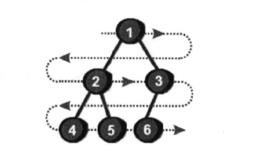
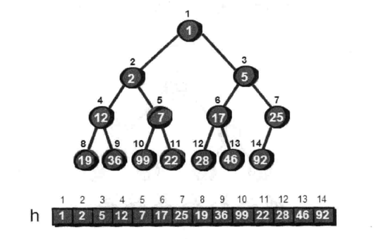

# 啊哈!算法 - 第七章 神奇的树

## 树 Tree
树 - 是不包含回路的连通无向图  
- 一棵树中任意两节点有且仅有唯一的一条路径连通  
- 一棵树如果有 n 个节点，那么就一定有 n-1 条边
- 在一棵树中加一条边将会构成一个回路

名词：根节点，父节点，子节点，叶节点
- 节点高度，节点到叶子节点的最长路径 
- 节点深度，根节点到这个节点所经历的边的个数
- 节点的层数，节点深度 + 1
- 树的高度，等于根节点的高度 

## 二叉树 Binary Tree

特殊的树，每个节点最多有两个子节点  

- 满二叉树
- 完全二叉树，一颗二叉树出了最右边位置上有一个或者几个叶节点缺少外，其他都是满的，那么就是完全二叉树  

### 完全二叉树的存储

- 链式存储
- 使用一维数组存储  
>  为了要满足完全二叉树的特性，且容易理解容易使用，所以使用数一维数组存储，数组下标是从 1 开始的，arr[0] = 0，元素 0 是不被使用了，这个在代码里是默认使用的  

  

父节点编号为 k，那么左子节点编号为 2*k，右子节点编号为 2*k+1  
如果子节点编号为 x，那么父节点编号为 x/2 取整，Math.floor(x/2)  
如果有 N 个节点，那么完全二叉树的高度是 log<sub>2</sub>N
最后一个非叶节点是第 n/2 个节点

典型应用 - 堆，完全二叉树

### 二叉树的遍历

- 前序遍历，对于树节点，先打印这个节点，然后再打印它的左子树，最后打印它的右子树 =》会发现根节点在开头
- 中序遍历，对于树节点，先打印它的左子树，然后再打印它本身，最后打印它的右子树 =》会发现根节点在中间
- 后序遍历，对于树节点，先打印它的左子树，然后再打印它的右子树，最后打印这个节点本身 =》会发现根节点在最后
- 层次遍历

二叉树的前、中、后序遍历就是一个递归的过程  

```javascript
// 前序遍历
var preorderTraversal = function(root) {
    let arr = [];
    let por = function (node) {
        if (node) {
            arr.push(node.val);
            por(node.left);
            por(node.right);
        }
    };
    por(root);
    return arr;
};

// 中序遍历
var inorderTraversal = function (root) {
    let arr = [];

    let ior = function (root) {
        if (root) {
            ior(root.left);
            arr.push(root.val);
            ior(root.right);
        }
    };
    ior(root);
    return arr;
};


// 后序遍历
var postorderTraversal = function (root) {
    let arr = [];
    let por = function (node) {
        if (node) {
            por(node.left);
            por(node.right);
            arr.push(node.val);
        }
    };
    por(root);
    return arr;
};
```

## 堆  

#### 堆，特殊的完全二叉树

- 最小堆，所有父节点都比子节点小
- 最大堆

  

> 圆圈里面的数是值，圆圈上面的数字是这个节点的编号  

#### 堆排序应用
- 删除最小值，在新增一个数，求最小值，使用 siftdown 方法
- 仅新增一个值，只需要将元素插入数组末尾，使用 siftup 方法

#### 堆的建立
1、循环插入元素到数组，使用 siftup 方法  
2、直接把所有元素放入数组，从第 n/2 个节点往上到 1 节点，循环使用 siftdown 方法

#### 堆排序  
1、使用最小堆进行从小到大的排序，每次取出 h[1]，把 h[1] = h[n]，使用 siftdown(1)，循环 n 次  
2、使用最大堆进行从小到大的排序

## 并查集 

靠左原则 和 擒贼先擒王原则


