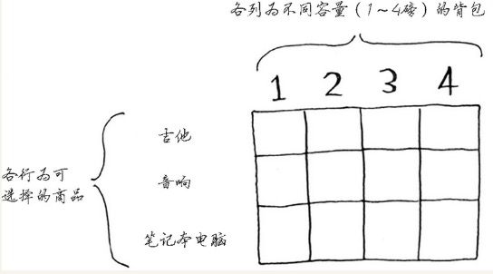
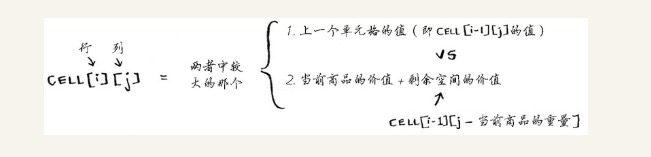

# 第 9 章　动态规划 

看完这章似懂非懂，可以多看几遍，可以多搜集一下资料，学习补充。  

## 背包问题

第 8 章学习使用`贪婪算法`求出`近似值`解决这个问题   

> 动态规划，先解决子问题，在逐步解决大问题  
> 仅当每个子问题都是离散的，即不依赖于其他子问题时，动态规划才管用  

    
    

### FAQ 

- 行的排列顺序不会对结果有影响
- 增加更小的商品，那么列的粒度更细

