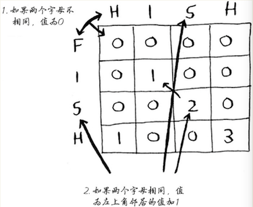

# 第 9 章　动态规划 

看完这章似懂非懂，可以多看几遍，可以多搜集一下资料，学习补充。  

## 背包问题

第 8 章学习使用`贪婪算法`求出`近似值`解决这个问题   

> 动态规划，先解决子问题，在逐步解决大问题  
> 仅当每个子问题都是离散的，即不依赖于其他子问题时，动态规划才管用 
> 要设计出动态规划解决方案很难   

    

    

### FAQ 

- 行的排列顺序不会对结果有影响
- 增加更小的商品，那么列的粒度更细
- 不能处理有依赖关系的子问题

### 思考？
在 《 啊哈!算法 》 6.1 节中的内容，多源最短路径问题求解中，就提到这个词 `动态规划`，但是没有细讲下去。 
那么如何分解子问题？  

根据背包问题，旅游行程最优化问题，多源最短路径问题，我肤浅的认为如果要分解成行列的二维结构，那么  
- 有明确限制条件的改成列，比如背包容量，比如行程天数，i->j 的距离  
- 可供选择的内容改成行，比如背包里放什么，比如去哪里，比如经过几个点  
- 然后根据需要选择设置当前点为最大、最小值  

`纯胡扯`  

## 最长公共子串  

### 最长公共子序列 

    

    

## 总结 